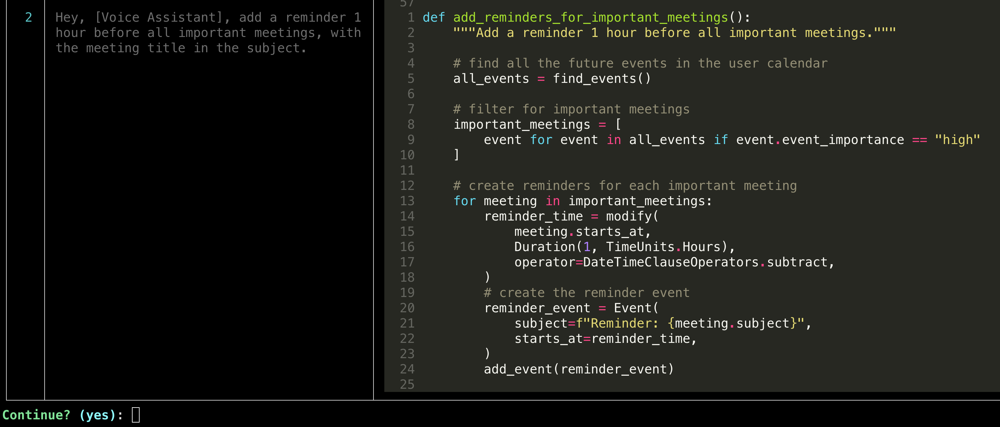
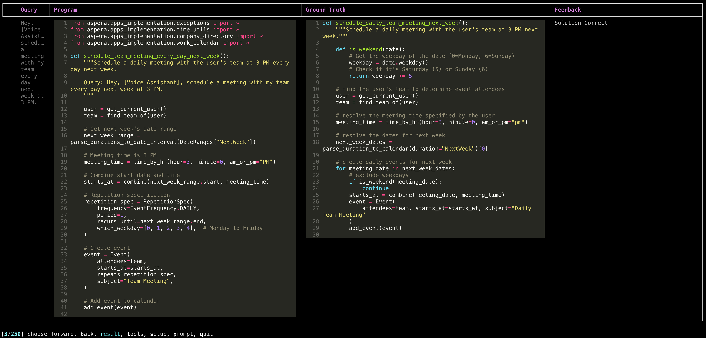

[](https://pyscaffold.org/)

# ✨ASPERA: A Simulated Environment to Evaluate Planning for Complex Action Execution

- [ℹ️ Introduction](#introduction)
- [📝 License](#license)
- [📦 Installation](#installation)
  - [🛠️ Prerequisites](#prerequisites)
  - [⚙️ Installing aspera](#installing-aspera)
- [📄 Cheatsheet](#-cheatsheet)
  - [❓ How do I explore the Asper-Bench dataset?](#-how-do-i-explore-the-asper-bench-dataset)
  - [❓ How do I benchmark my LLM on the Asper-Bench?](#-how-do-i-benchmark-my-llm-on-the-asper-bench)
  - [❓ How do I implement my own custom agent?](#-how-do-i-implement-my-own-custom-agent)
  - [❓ How do I replicate the experiments in the paper?](#how-do-i-replicate-the-experiments-in-the-paper)
  - [❓ How do I generate more data like Asper-Bench?](#-how-do-i-generate-more-data-like-asper-bench)
  - [❓ How can I understand more about the ASPERA data generation engine and how to extend ASPERA for my own domains?](#-how-can-i-understand-more-about-the-aspera-data-generation-engine-and-how-to-extend-aspera-for-my-own-domains)
- [🚀 Asper-Bench walkthrough](#-asper-bench-walkthrough)
  - [🛠️ Implementing a custom agent](#implementing-a-custom-agent)
  - [📊 Evaluating your agent on Asper-Bench](#-evaluating-your-agent-on-asper-bench)
  - [🔍 Inspect your agent's programs](#-inspect-your-agents-programs)
- [🔄 Generating data with ASPERA](#-generating-data-with-aspera)
- ️[🔧 The ASPERA framework](#-the-aspera-framework)
  - ️[🛠 Assistant library](#assistant-library)
  - [🏗️ The data generation engine](#-the-data-generation-engine)
  - 📈 [Extending the simulation](#-extending-the-simulation)

<h1 id="License">📝License</h1>

---

This code is released under the Apple Sample Code License (see [LICENSE](LICENSE)). The dataset is released under the CC-By-NC-ND license (see [LICENSE_DATASET](LICENSE_DATASET)).


<h1 id="introduction">ℹ️ Introduction</h1>

---

Accompanies the paper [<i>ASPERA: A Simulated Environment to Evaluate Planning for Complex Action Execution</i>](https://arxiv.org/abs/2507.15501).

ASPERA is a framework comprising a simulation and a human-assisted LLM data generation engine built for the purpose of evaluating the ability of large language models to perform complex actions on behalf of users in a digital assistant setting. 

Solving ASPERA tasks involves parsing user queries into programs involving compositional reasoning to perform a complex series of actions in the correct order.

As an example, the user may request:
> _**Hey, Assistant, schedule a meeting with my team every day next week at 3 PM.**_

Given access to APIs and other primitives defined in the _assistant library_ we expect a program which satisfies this user goal. For example:

```python
def schedule_daily_team_meeting_next_week():
    """Schedule a daily meeting with the user's team at 3 PM next week."""

    def is_weekend(date):
        # Get the weekday of the date (0=Monday, 6=Sunday)
        weekday = date.weekday()
        # Check if it's Saturday (5) or Sunday (6)
        return weekday >= 5

    # find the user's team to determine event attendees
    user = get_current_user()
    team = find_team_of(user)

    # resolve the meeting time specified by the user
    meeting_time = time_by_hm(hour=3, minute=0, am_or_pm="pm")

    # resolve the dates for next week
    next_week_dates = parse_duration_to_calendar(duration="NextWeek")[0]

    # create daily events for next week
    for meeting_date in next_week_dates:
        # exclude weekdays
        if is_weekend(meeting_date):
            continue
        starts_at = combine(meeting_date, meeting_time)
        event = Event(
            attendees=team,
            starts_at=starts_at,
            subject="Daily Team Meeting"
        )
        add_event(event)
```

ASPERA determines whether the assistant actions satisfy the user goal by evaluating the functional correctness of the generated program. To support this, we provide a simulation of the assistant library and an interactive data generation engine which generates environment state and programs which determine the functional correctness.

Alongside the framework we release _Asper-Bench_, an evaluation dataset of 250 tasks generated using ASPERA to evaluate the complex action execution capability of popular LLMs.

<h1 id="installation">📦 Installation</h1>

---

<h2 id="prerequisites">🛠️ Prerequisites</h1>


To set up the environment, you'll need `python>=3.11`(https://www.python.org/downloads/release/python-3113/), [`pyenv`](https://github.com/pyenv/pyenv#installation) and [`pipenv`](https://pipenv.pypa.io/en/latest/). For the default configuration, you will also need an `OpenAI` API key set to the `OPENAI_API_KEY` environment variable in your terminal.

<h2 id="installing-aspera">⚙️ Installing aspera</h1>

To install `aspera`, simply run:

````bash
make install
````

To run commands in the underlying virtual environment, either activate the environment with `pipenv shell` or prepend each command with `pipenv run`. 

For contributors, we recommend installing the pre-commit hooks with `pre-commit install`.

# 📄 Cheatsheet

---

## ❓ How do I explore the Asper-Bench dataset?

The Asper-Bench corpus can be found in the [assets](assets/) directory, as a compressed tarball (to reduce size and avoid data leakage). `make install` uncompresses this into a directory `asper_bench` upon installation.

To view the Asper-Bench user queries alongside the reference programs from Asper-Bench which execute them, run:

```bash
pipenv run aspera-read-sample-solutions
```

For instructions on expanding, updating or replacing the dataset, see [Generating data with ASPERA](#-generating-data-with-aspera).



For a more detailed view of ASPERA tasks, we recommend running an agent experiment and browsing the results; see [Inspect your agent's programs](#-inspect-your-agent's-programs). For convenience, we have provided a sample results file for browsing:
```bash
pipenv run aspera-view-results resources/sample_results.jsonl
```


## ❓ How do I benchmark my LLM on the Asper-Bench?

The absolute simplest way to do so is to deploy your model in `huggingface` and then run the command

```bash
pipenv run aspera-run-agent completer.model_name=<my huggingface hub model ID>  --config-name=huggingface 
```

Having done this, see [Evaluating your agent on ASPER bench](#-evaluating-your-agent-on-asper-bench) for the next steps.

## ❓ How do I implement my own custom agent?

See [Asper-Bench walkthrough](#-asper-bench-walkthrough).

<h2 id="how-do-i-replicate-the-experiments-in-the-paper">❓How do I replicate the experiments in the paper?</h1>

For commands to replicate the results presented in our paper, please refer to [experiments.md](experiments.md).

## ❓ How do I generate more data like Asper-Bench?

See [Generating data with ASPERA](#-generating-data-with-aspera).

## ❓ How can I understand more about the ASPERA data generation engine and how to extend ASPERA for my own domains?

See [The ASPERA framework](#-the-aspera-framework).

# 🚀 Asper-Bench walkthrough

---

<h2 id="implementing-a-custom-agent">🛠️ Implementing a custom agent</h1>


Implementing your agent in ASPERA is simple! We provide an [agent interface](src/aspera/agent/base_agent.py) which your agent should inherit. This interface:

- contains a `plan` method, which agents should implement to execute the complex action requested by the user
- contains a `submit_solution` endpoint, which the agent should call to submit the generated action execution program for evaluation

Hence, your agent should implement a `plan` method, with signature shown below:

```python
class SmartAgent(BaseAgent):

    def plan(self, query: DataPoint) -> Solution:
        # your code here
        ...
```

Here `DataPoint` is an ASPERA task (see Section 2.2 of our paper). For agent implementation purposes, the following task attributes are relevant:

- `query`: the user query
- `state_generation_programs`: a list of setup programs which initialise the environment so that the agent final program or intermediate steps can be executed
- `scenario.apps`: a list of `aspera` module names which implement the primitives required for program generation
- `scenario.query_solution`: a list of module names under `src/aspera/examples` where the in-context examples for program generation are stored

The agent should return a `Solution` object with the schema

```python
class Solution(BaseModel):
    query: str
    program: ProgramStr
```

where `program` is the program the agent generated to execute the user action:

```python
from aspera.apps_implementation.work_calendar import find_events
from aspera.apps_implementation.company_directory import find_employee


def count_meetings_with_jianpeng() -> int:
   """Count the number of meetings with Jianpeng in the user's calendar."""

   # find the employee named Jianpeng
   jianpeng = find_employee("Jianpeng")[0]  # by structure guideline #1

   # find all events with Jianpeng
   events_with_jianpeng = find_events(attendees=[jianpeng])

   # return the count of these events
   return len(events_with_jianpeng)
```

To simplify prompt building, the assistant library is implemented in `src/aspera/apps_implmenentation`, while the documentation for the primitives the LLM should use for program generation are listed as stubs in `src/aspera/apps`.

## 📊 Evaluating your agent on Asper-Bench

We provide a `hydra` configurable endpoint for the purpose of running and evaluating agents. This can be run as follows:

````bash
pipenv run aspera-run-agent --config-name=smart_agent_config
````

where `smart_agent_config` is the configuration for your agent, which you should place [here](src/aspera/configs/agent). Check
out the implementation of our [CompleteCodebaseKnowledge agent](src/aspera/agent/complete_codebase_knowledge.py) and its [configuration](src/aspera/configs/agent/complete_codebase_knowledge.yaml)
to get started with defining your own configuration.

When running an agent, for each query the `plan` method will be called and its output passed to `submit_solution` for functional correctness evaluation of the generated program. Users implementing self-reflecting agents can modify the endpoint to make multiple calls to `submit_solution`, unless the agent program triggered a `SolutionError`.

When all queries have been executed, the `score` property will report the percentage of queries that the agent has solved correctly (i.e., the task completion rate or task success). 

The agent predictions are stored in a `results.jsonl` file in a sub-directory of `results/` (sub-directory hierarchy depends on your configuration), which will also contain the metrics under `metrics.json`.

## 🔍 Inspect your agent's programs

In order to browse and review agent experiment results, we provide a CLI which shows proposed solutions compared to the sample solution, state initialisation and evaluation programs, alongside feedback from the evaluator:

````bash
pipenv run aspera-view-results <path/to/results.jsonl>
````

From here, use the onscreen instructions to browse the results. For debugging purposes, you can also view the prompt used for the generated solution.



You can also use your favourite debugger to step through the LLM-generated programs, as a `python` module is output for every query in the `executable` sub-directory.

# 🔄 Generating data with ASPERA

---

ASPERA can generate tasks comprising:

 - A user query
 - A reference program showing one possible way the agent can execute the user action in the environment
 - A program which initialises the environment 
 - A program which verifies that the action executed satisfies the user goal

For more details see [The data generation engine](#the-data-generation-engine).

The core of an ASPERA task is the user query. We can initialise ASPERA task generation in one of two ways: 1) the user query is an input from the user, and the LLM generates candidate programs to solve, simulate and evaluate it, or 2) the query is generated jointly by the LLM alongside the programs.

To generate tasks solving custom queries, edit `queries` in [this](src/aspera/configs/query_label/org_events.yaml) config and run:
````bash
pipenv run aspera-annotate-queries
````

To generate tasks with LLM-generated queries, run:

````bash
pipenv run aspera-generate-queries
````

This will generate tasks grounded in the ASPERA [assistant library](#assistant-library) using the latest OpenAI `gpt-4o` model.

You can customise the model, the in-context examples and the task generation instructions by editing [this](src/aspera/configs/query_label/org_events.yaml) and [this](src/aspera/configs/query_generation/org_events.yaml) for (1) or (2), respectively.

In either case, ASPERA will begin generating tasks and stop at various points for human review, prompting the user to open a generated file and edit it to approve the annotation, make changes and/or provide further instructions. 

Upon completion, generated data will appear in the `data/` directory. To generate a new `asper_bench_<timestamp>.tgz` tarball, rename this directory to `asper_bench` and run the `make compress` target.

# 🔧 The ASPERA framework

---

<h2 id="assistant-library">🛠️ Assistant library</h1>

Our simulation contains five modules (`company_directory`, `room_booking`, `work_calendar`, `exceptions` and `time_utils`), comprising 43 functions, 10 objects and 9 enums. This simulation is used for solving—as well as generating and evaluating—the user queries present in our evaluation corpus (or any arbitrary query in the same domain).

For more information, as well as instructions on extending the simulation, please refer to [Extending the simulation](#-extending-the-simulation).

<h2 id="the-data-generation-engine">🏗️ The data generation engine</h1>

Our simulation powers two human-in-the-loop pipelines in which a human and an LLM collaborate in complex query generation and annotation. Motivated by the fact that LLMs are proficient at writing code, we pose the query generation problem as a program synthesis task.

### Query generation

Queries are generated given a _scenario_ comprising:
   - a list of apps which ground the query
   - a list of in-context examples of queries and associated solutions
   - a list of _guidelines_ which the agent should account for when writing programs. This is a simplified
way of including common-sense knowledge, controlling program style and ensuring that the program follows the system policy. An example of this is: _"Work meetings can start after 9:06 AM and should end before 5:10 PM. They don't happen at the weekend unless the user explicitly mentions so."_

This scenario is used to generate a prompt which shows the agent the documentation of the application code for the selected apps and tasks them with jointly generating queries and their solution program. 

### Runtime state (SIP) generation

Evaluating complex queries is challenging as many programs can lead to the same execution outcome. It is thus necessary to assert whether the changes effected by the agent are expected given the user query.

By prompting the LLM, we can generate code that creates the relevant databases and entities that would exist in an execution environment. Here's an example for the query _repeat my meeting with Jianpeng weekly._

```python
def setup_env_repeat_meeting_with_jianpeng_weekly():
    """Simulate the environment for the query:

    Hey, [Assistant], repeat my meeting with Jianpeng weekly."""

    # import locally any standard library modules
    import datetime

    # Step 1: Create org structure with Jianpeng and 3 other members
    default_employee_names = ["Jianpeng", "Alice", "Bob", "Charlie"]
    simulate_org_structure(default_employee_names)

    # Step 2: Ensure the event referenced in the query exists in the user's calendar
    # setup guideline #1
    meeting_date = now_().date()
    # setup guideline #2
    meeting_start_time = datetime.time(hour=10, minute=0)
    meeting_end_time = datetime.time(hour=11, minute=0)
    starts_at = combine(meeting_date, meeting_start_time)
    ends_at = combine(meeting_date, meeting_end_time)
    # setup guideline #3
    attendees = [find_employee("Jianpeng")[0]]  # setup guideline #4
    subject = "Sync"
    query_event = Event(
        attendees=attendees, starts_at=starts_at, ends_at=ends_at, subject=subject
    )
    add_event(query_event)

    # Step 3: Create additional events to test understanding
    # A meeting with Jianpeng the day before
    confounder_1 = Event(
        attendees=attendees,
        starts_at=starts_at - datetime.timedelta(days=1),
        ends_at=ends_at - datetime.timedelta(days=1),
        subject=subject,
    )
    add_event(confounder_1)

    # A meeting with Alice on the same day
    attendees = [find_employee("Alice")[0]]  # setup guideline #4
    confounder_2 = Event(
        attendees=attendees,
        starts_at=starts_at + datetime.timedelta(hours=3),
        ends_at=ends_at + datetime.timedelta(hours=4),
        subject="Project Update",
    )
    add_event(confounder_2)
```

Note that the agent uses a combination of the same tools that it uses to program, but there are additional tools such as `simulate_org_structure` that allow it to generate the relevant state. The `#setup guideline` comments mark assumptions about the environment that the agent is allowed to make in a manner similar to the guidelines for query generation. Importantly:
 - For a given query, multiple such programs may be specified, allowing for fine-grained testing of agent capabilities
 - We circumvent the problem of prompting the agent with complex database schemata and manually specifying the entities in the query

For practical reasons, a single runtime state is specified for each query at this time.

### Execution test (EP) generation

In addition to the codebase, the evaluation program generation prompt includes the SIP program which sets the runtime state and, optionally, additional tools which the LLM can use to verify the execution result. The LLM then generates a test function which resembles the following:

```python
def evaluate_repeat_meeting_with_jianpeng_weekly(
    query: str, executable: Callable[[], Any], setup_function: Callable[[], Any]
):
    """Validate that `executable` program for the query

    Hey, [Assistant], repeat my meeting with Jianpeng weekly.

    has the expected effect on the runtime environment.

    Parameters
    ----------
    query
        The query to validate.
    executable
        The query execution function, `repeat_meeting_with_jianpeng_weekly`
    setup_function
        `setup_env_repeat_meeting_with_jianpeng_weekly` function."""

    import datetime

    # Step 1: setup runtime environment
    setup_function()
    all_events_before = find_events()

    # Step 2: run the solution
    _ = executable()

    # Step 3: check effects on runtime environment are as expected
    all_events_after = find_events()

    # check no new event was created, only the existing event is updated
    try:
        assert len(all_events_after) == len(all_events_before)
    except AssertionError:
        raise SolutionError("Incorrect solution")

    meeting_date = now_().date()
    meeting_start_time = datetime.time(hour=10, minute=0)
    meeting_end_time = datetime.time(hour=11, minute=0)
    starts_at = combine(meeting_date, meeting_start_time)
    ends_at = combine(meeting_date, meeting_end_time)

    # looking for the updated event
    updated_event = None
    for event in all_events_after:
        if (
            event.starts_at == starts_at and
            event.ends_at == ends_at and
            any(att.name == "Jianpeng" for att in event.attendees)
        ):
            updated_event = event
            break

    try:
        assert updated_event is not None
        assert updated_event.repeats is not None
        assert updated_event.repeats.frequency == EventFrequency.WEEKLY
    except AssertionError:
        raise SolutionError("Incorrect solution")
```

## 📈 Extending the simulation

Simulation tools are defined in `src/aspera/apps_implementation`, while stubs used for constructing prompts are found in `src/aspera/apps`. The steps for implementing a new tool are:

1. Familiarise yourself with the implementation for our `ExecutionContext`, under `src/aspera/simulation/execution_context.py`
2. Update `src/aspera/simulation/database_schemas.py` with any new databases as required
3. Implement the tools under an appropriate module in `src/aspera/apps_implementation` and add its docstrings under the appropriate module in `src/aspera/apps`
4. If necessary, implement tools that the LLM needs to generate the runtime state under `runtime_state_generation_tools_implementation` and add their docs under `runtime_state_generation_tools`.
5. If necessary, implement tools that the LLM needs to test the execution is correct under `execution_evaluation_tools_implementation`
and add their docs under `execution_evaluation_tools`

> When are custom simulation tools required?

This is usually required if it's too difficult for the LLM to generate the entities directly. For example,
generating a coherent org structure with all the employee details is too challenging, so we implement `simulate_org_structure` to avoid that. Meanwhile, generating events and contacts is relatively easy so specialised tools are not required.

> When are custom evaluation tools required?

If the LLM cannot check the execution results given the tools the app implements alone. For example, if the user asks for their calendar to be shared with somebody, the LLM cannot check if this happened because the calendar is just a collection of events in a database. Instead, the LLM can be provided with a `assert_calendar_shared` tool which checks for side effects of the `share_calendar` tool in the backend.
